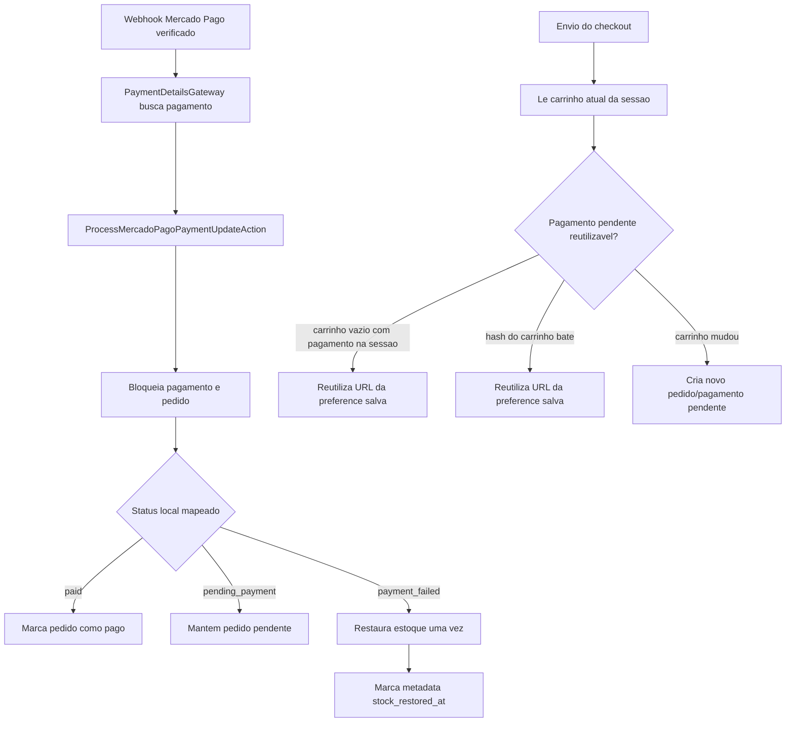

# Resumo da Wave 05

## Objetivo Da Wave

Esta wave completa o caminho verificado de atualizacao de pagamento Mercado Pago e reforca a reutilizacao de preferences pendentes do Checkout Pro.

Ela entrega:

- contrato `PaymentDetailsGateway` para buscar os detalhes completos do pagamento no Mercado Pago depois de um webhook verificado
- normalizacao dos campos do pagamento do provedor antes de alterar estado local
- atualizacao idempotente de pagamento/pedido guiada pelos dados buscados no provedor, nao por query params de retorno do navegador
- protecoes de valor e moeda antes de um pagamento aprovado marcar o pedido como pago
- restauracao idempotente de estoque quando um pagamento chega a um estado terminal de erro
- protecao contra reutilizar uma preference pendente antiga do Mercado Pago quando o carrinho atual mudou
- reutilizacao segura da preference pendente da sessao quando o carrinho esta vazio depois de iniciar checkout
- cobertura de regressao para idempotencia do processamento de pagamento, webhook e reutilizacao de preference no checkout

## Fluxo Curto

## Direcao Principal Das Chamadas Entre Modulos

### Payments

- `HandleMercadoPagoWebhookAction` chama o processador de pagamento apenas depois da validacao da assinatura e apenas para o evento `payment`.
- `PaymentDetailsGateway` isola a chamada Mercado Pago `GET /v1/payments/{id}` atras de um contrato.
- `ProcessMercadoPagoPaymentUpdateAction` mantem o processamento de status dentro de transacao, encontra o pagamento local por `external_reference` e restaura estoque quando o Mercado Pago mapeia para `OrderStatus::PaymentFailed`.
- Pagamentos aprovados so marcam pedidos como `paid` quando valor e moeda do provedor batem com o pagamento local.
- `CreateCheckoutPreferenceAction` grava o pagamento local pendente na sessao para que uma nova tentativa com carrinho vazio possa reutilizar a mesma URL do Checkout Pro.

### Cart

- O carrinho continua sendo a fonte de verdade da intencao atual de compra do cliente.
- Se um carrinho nao vazio bate com o hash do checkout pendente existente, a preference pendente e reutilizada.
- Se o carrinho mudou, o checkout cria um novo pedido/pagamento pendente em vez de redirecionar o cliente para uma preference antiga.

### Catalog E Orders

- O estoque do produto ainda e decrementado quando o pedido pendente e criado.
- O estoque e restaurado apenas uma vez quando o pagamento associado chega a um estado terminal de erro.
- O marcador de restauracao de estoque fica na metadata do pagamento para que webhooks repetidos nao restaurem estoque varias vezes.

## Ideia Central De Cada Modulo

### Payments

Ideia central:
controlar checkout e transicoes de estado vindas de pagamento mantendo detalhes do Mercado Pago atras de Actions e gateways.

O que faz agora:

- busca detalhes completos do pagamento no Mercado Pago no servidor depois de um webhook verificado
- inicia Checkout Pro a partir de um pedido/pagamento pendente local
- reutiliza uma preference existente apenas quando ela ainda representa o estado atual do carrinho
- mapeia status aprovado, pendente e falho do Mercado Pago para estados locais de pagamento/pedido
- mantem o pedido pendente se uma resposta aprovada do provedor nao bate com valor/moeda local
- restaura estoque uma vez para resultados de pagamento falhos, cancelados, reembolsados ou em chargeback

### Cart

Ideia central:
representar a intencao atual de compra do cliente ate o checkout ter uma referencia local duravel de pedido/pagamento.

O que faz agora:

- impede que referencias antigas de pagamento na sessao ignorem mudancas no carrinho
- pode estar vazio depois do redirect do checkout enquanto a sessao ainda aponta para o pagamento pendente reutilizavel

### Orders E Catalog

Ideia central:
manter o movimento de estoque explicito ao redor das mudancas de estado de pedido/pagamento.

O que fazem agora:

- pedidos mantem o status local de pagamento/atendimento
- itens do pedido fornecem as quantidades para restauracao de estoque
- produtos do catalogo recebem estoque de volta exatamente uma vez quando um pagamento falha de forma terminal

## O Que Esta Wave Ainda Nao Cobre

Esta wave ainda nao inclui:

- fulfillment automatico depois da conclusao do pagamento
- melhorias de visibilidade de pagamento no admin alem do estado local agora ser atualizado
- orquestracao de reembolso alem de mapear status reembolsado/chargeback para estado de pagamento falho
- expiracao ou limpeza de pagamentos pendentes abandonados
- um ledger mais amplo de reserva de inventario
- historico de conta do cliente ou reconciliacao de carrinho entre multiplas sessoes

## Leitura Pratica Do Design

Se quiser a interpretacao mais curta:

1. um webhook verificado agora busca o pagamento completo no Mercado Pago antes de atualizar pagamento/pedido local
2. um pagamento Mercado Pago aprovado/acreditado marca o pedido local como `paid`
3. um pagamento Mercado Pago aprovado com valor/moeda divergente fica preservado para analise em vez de marcar o pedido como pago
4. um pagamento Mercado Pago falho nao deixa mais estoque reservado permanentemente
5. um id de pagamento antigo na sessao nao redireciona mais o cliente para um checkout com conteudo antigo do carrinho
6. webhooks repetidos e submits duplicados de checkout continuam cobertos por testes focados de pagamento
