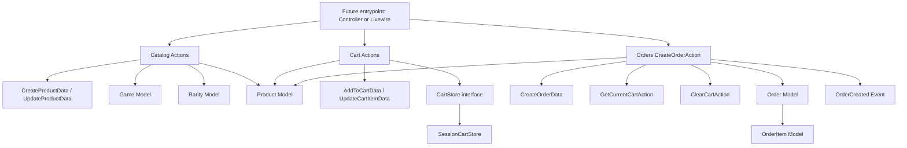

# Wave 01 Summary

## Wave Goal

This wave created the core foundation for the MVP domains:

- `Catalog`: defines and organizes the products
- `Cart`: stores the current shopper cart in session
- `Orders`: converts the cart into an order

The goal was to prepare the core purchase flow without introducing the HTTP layer, UI, real payment processing, or richer operational notifications yet.

## Short Flow

## Main Call Direction Between Modules

### Catalog

- `CreateProductAction` and `UpdateProductAction` receive DTOs
- validate `Game` and `Rarity` references
- validate `price` and `quantity`
- persist through `Product`

### Cart

- `AddToCartAction`, `UpdateCartItemAction`, `RemoveFromCartAction`, `GetCurrentCartAction`, and `ClearCartAction`
- use `CartStore` as the contract
- the current implementation is `SessionCartStore`
- `Cart` queries `Catalog\Product` to ensure the product exists and was not soft deleted

### Orders

- `CreateOrderAction` receives `CreateOrderData`
- calls `GetCurrentCartAction` to read the current cart
- queries `Catalog\Product` again to revalidate existence and stock
- opens a transaction
- creates `Order`
- creates `OrderItem`
- decrements stock in `Product`
- clears the cart with `ClearCartAction`
- dispatches `OrderCreated`

## Central Idea Of Each Module

### Catalog

Central idea:
be the source of truth for the MVP catalog.

What it does:

- models `Game`, `Rarity`, and `Product`
- ensures every product belongs to one game and one rarity
- ensures `price` and `quantity` enter the system in a valid state through Actions

What it is expected to do:

- create and update products safely
- preserve the MVP classification model as only `game` + `rarity`
- serve as the base for Cart and Orders

### Cart

Central idea:
keep the current cart state simple and safe.

What it does:

- adds items
- updates quantities
- removes items
- returns the current cart
- clears the cart

What it is expected to do:

- store only the minimum data needed for checkout
- never trust price coming from outside
- merge repeated items instead of duplicating lines
- work without leaking request concerns into Actions
- stay simple while the MVP uses session storage

### Orders

Central idea:
turn a valid cart into a persisted order.

What it does:

- validates the minimum buyer contact input: `email` and `whatsapp`
- validates that the cart is not empty
- revalidates products and stock in the database
- creates the order and order items inside a transaction
- reduces stock
- dispatches an order-created event

What it is expected to do:

- guarantee consistency in the purchase flow
- prevent orders with invalid stock state
- stay compatible with manual fulfillment
- leave a clear extension point for future notifications and automation

## What This Wave Does Not Cover Yet

This wave still does not include:

- controllers or routes
- Form Requests
- Policies or Gates
- payment processing
- automated delivery
- full operational notification flow
- cart or checkout UI

## Practical Reading Of The Design

If you want the shortest interpretation:

1. `Catalog` defines what can be sold.
2. `Cart` stores what the user wants to buy right now.
3. `Orders` closes the purchase using the current cart and the real stock state.

That is the core of Wave 01.
