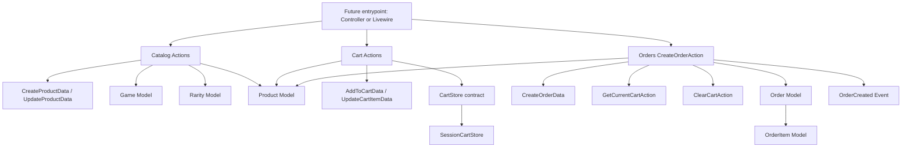

# Wave 01 Summary

## Wave Goal

This wave delivers the first complete backend backbone for the MVP purchase flow:

- `Catalog` defines what can be sold
- `Cart` stores the current shopper cart in session
- `Orders` turns the current cart into a persisted order

The focus stays on the core domain flow only. This wave does not introduce controllers, routes, checkout UI, payment processing, or automated fulfillment.

## Short Flow

## Main Call Direction Between Modules

### Catalog

- `CreateProductAction` and `UpdateProductAction` receive DTOs
- validate `Game` and `Rarity` references
- validate `price` and `quantity`
- persist through `Product`

### Cart

- `AddToCartAction`, `UpdateCartItemAction`, `RemoveFromCartAction`, `GetCurrentCartAction`, and `ClearCartAction`
- use `CartStore` as the contract
- currently resolve to `SessionCartStore`
- verify the selected product still exists and is not soft deleted
- keep cart lines normalized by `product_id`

### Orders

- `CreateOrderAction` receives `CreateOrderData`
- reads the current cart through `GetCurrentCartAction`
- validates the cart is not empty and rejects corrupted item quantities before persistence
- revalidates products and stock directly from `Catalog\Product`
- opens a transaction to create `Order` and `OrderItem`
- decrements stock from the confirmed product rows
- clears the cart after a successful persistence flow
- dispatches `OrderCreated`

## Central Idea Of Each Module

### Catalog

Central idea:
be the source of truth for the MVP catalog.

What it does:

- models `Game`, `Rarity`, and `Product`
- keeps product classification limited to `game` and `rarity`
- stores `price` as integer cents
- validates product write input through Actions

What it is expected to do now:

- create and update products safely
- preserve the MVP classification model without adding `category`
- serve as the shared product source for Cart and Orders

### Cart

Central idea:
keep the current cart state simple, session-based, and application-safe.

What it does:

- adds items
- updates quantities
- removes items
- returns the current cart
- clears the cart

What it is expected to do now:

- store only the minimum data needed for the current checkout handoff
- avoid trusting externally supplied price data
- merge repeated adds for the same product instead of duplicating lines
- stay independent from HTTP concerns

### Orders

Central idea:
turn a valid cart plus minimal contact data into a persisted order.

What it does:

- validates `email` and `whatsapp`
- rejects empty carts
- rejects corrupted cart quantities before creating records
- rechecks product existence and stock inside a transaction
- creates the order and its items
- decrements stock
- dispatches `OrderCreated`

What it is expected to do now:

- keep the purchase flow consistent for manual fulfillment
- make the initial order status explicit
- prevent invalid stock state from being persisted
- leave a clean extension point for future notifications and async work

## What This Wave Does Not Cover Yet

This wave still does not include:

- controllers or routes
- Form Requests
- Policies or Gates
- payment capture or gateway integration
- automated delivery
- internal notification orchestration beyond `OrderCreated`
- cart or checkout UI

## Practical Reading Of The Design

If you want the shortest interpretation:

1. `Catalog` defines what exists and what can be sold.
2. `Cart` stores what the shopper wants right now.
3. `Orders` turns that cart into a real order using the current stock state.

That is the core of Wave 01.
