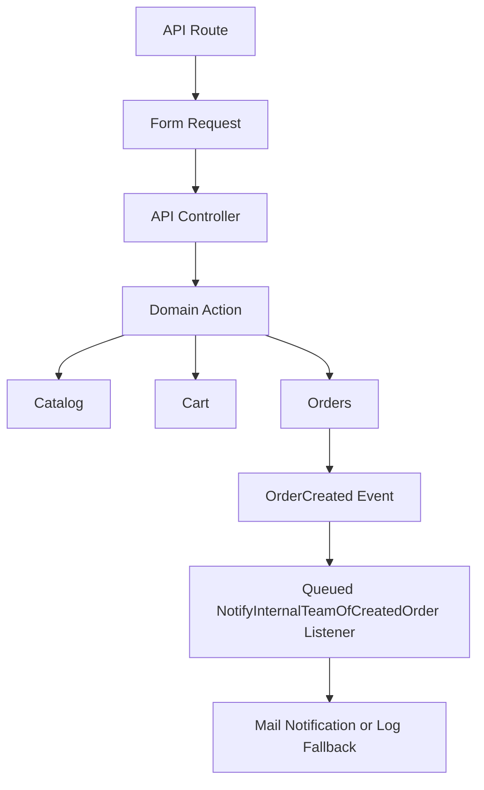

# Wave 02 Summary

## Wave Goal

This wave exposed the approved MVP backend flow through a thin API layer and added the first internal operations hook for manual fulfillment.

It delivers:

- read access to the catalog through `/api/catalog/products`
- session-backed cart mutation endpoints under `/api/cart`
- order creation through `/api/orders`
- localized API success and error messages
- an internal order notification boundary triggered by `OrderCreated`

## Short Flow

## Main Call Direction Between Modules

### API Entry Layer

- API routes are registered from `AppServiceProvider`
- Form Requests validate the HTTP input shape
- controllers stay thin and only map validated input into Actions
- expected domain failures are translated into stable JSON error payloads inside the API controller layer

### Catalog Read

- `CatalogProductController` calls `SearchCatalogProductsQuery`
- products are filtered by optional `game_id` and `rarity_id`
- only available products are returned
- filter metadata exposes the current game and rarity options

### Cart And Orders

- `CartController` uses the existing Cart Actions without leaking HTTP concerns into the module
- cart endpoints still use session persistence, so cart and order API routes run with session middleware
- `OrderController` delegates order creation to `CreateOrderAction`

### Internal Notification

- `OrderCreated` now fans out to a queued listener
- the listener sends an on-demand mail notification to the internal recipient when configured
- if no internal recipient is configured, a masked log fallback records the event without exposing raw buyer contact data

## Central Idea Of Each Module

### API Layer

Central idea:
be a thin transport boundary for the already-approved MVP use cases.

What it does now:

- validates request shape
- returns consistent JSON payloads
- translates expected domain failures into stable API error responses

### Orders Operations

Central idea:
make a newly created order operationally visible without pretending fulfillment or payment automation already exists.

What it does now:

- emits `OrderCreated`
- queues the internal notification listener
- uses Laravel-native notification and queue boundaries

## What This Wave Does Not Cover Yet

This wave still does not include:

- storefront UI
- admin UI
- authentication expansion
- payment capture
- webhook handling
- automated item delivery

## Practical Reading Of The Design

If you want the shortest interpretation:

1. the API layer validates HTTP input and calls Actions
2. Actions still own the business flow
3. `OrderCreated` is now the first operational handoff point for internal manual fulfillment
