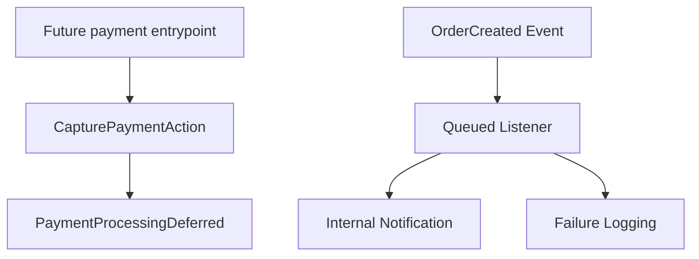

# Wave 03 Summary

## Wave Goal

This wave prepared the codebase for future payment and asynchronous work without introducing fake integrations or distributed-system complexity.

It delivers:

- a minimal `CapturePaymentAction` boundary in the `Payments` module
- an explicit deferred-payment exception instead of a pretend gateway flow
- a queued listener pattern around `OrderCreated`
- failure logging for background notification handling

## Short Flow

## Main Call Direction Between Modules

### Payments

- `CapturePaymentAction` receives a payment DTO
- the action throws `PaymentProcessingDeferred`
- this keeps the boundary explicit without simulating PIX or card capture

### Async Readiness

- `OrderCreated` stays the synchronous domain event emitted by order creation
- background work is attached through a queued listener, not by inflating the order action
- listener failures are logged with order context and without broad sensitive data leakage

## Central Idea Of Each Module

### Payments

Central idea:
reserve a clean entrypoint for future payment work while keeping MVP scope honest.

What it does now:

- defines the payment capture boundary
- makes the deferred state explicit
- avoids fake success paths

### Orders Async Boundary

Central idea:
show how the project should grow into queued side effects without making the current MVP operationally heavy.

What it does now:

- keeps the event synchronous and explicit
- moves follow-up work into a queued listener
- logs background failures for maintainability

## What This Wave Does Not Cover Yet

This wave still does not include:

- real PIX integration
- real credit card integration
- webhooks
- retry orchestration
- outbox implementation
- advanced queue operations

## Practical Reading Of The Design

If you want the shortest interpretation:

1. payment has a real boundary now, but still no real processing
2. orders already expose a queue-ready side-effect boundary
3. the MVP remains simple while the next architectural step is now clear
