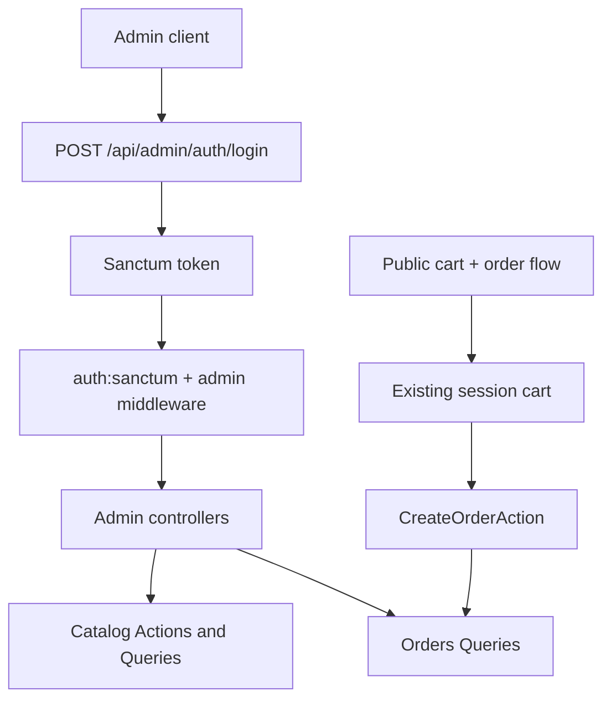

# Wave 04 Summary

## Wave Goal

This wave adds the full backend admin boundary for the MVP without changing the public shopping flow.

It delivers:

- a simple admin identity model with `username` and `admin|customer` roles
- Sanctum token authentication for admin APIs
- protected admin CRUD endpoints for games, rarities, and products
- protected admin read endpoints for orders and buyer contact data
- shared JSON handling for admin authentication, authorization, validation, and expected domain failures

## Short Flow

## Main Call Direction Between Modules

### Admin Authentication

- admin login validates `username` or `email`, password, and device name
- `AuthenticateAdminAction` resolves the user and rejects non-admin accounts
- Sanctum issues the token and protected routes use `auth:sanctum` plus the admin middleware

### Admin Catalog

- admin controllers stay thin and delegate writes to Catalog Actions
- product writes reuse the existing product DTO-based Actions
- game, rarity, and product reads use dedicated admin Queries where the read shape differs from the public catalog
- delete protection for games and rarities stays inside explicit Catalog Actions

### Admin Orders

- order creation remains in the public Orders flow and still depends on the session-backed cart
- admin order endpoints are read-only and use Orders Queries
- admin responses expose buyer contact data and order items for manual fulfillment

## Central Idea Of Each Module

### Admin

Central idea:
provide a secure API entry boundary for staff users without introducing a larger auth stack.

What it does now:

- authenticates admins with Sanctum tokens
- blocks customers and anonymous callers from admin routes
- exposes only the backend capabilities needed for the MVP admin workflow

### Catalog

Central idea:
keep catalog ownership inside the Catalog module even when the caller is the admin API.

What it does now:

- manages game, rarity, and product CRUD for admins
- keeps `game + rarity` as the only catalog dimensions
- preserves the public rule that only available products appear in the storefront

### Orders

Central idea:
separate public order creation from admin fulfillment reads.

What it does now:

- keeps public order creation unchanged
- exposes admin-only list/show reads for operational follow-up
- returns buyer email, WhatsApp, and purchased items for manual fulfillment

## What This Wave Does Not Cover Yet

This wave still does not include:

- an admin frontend
- fine-grained permission matrices
- customer accounts or public registration
- payment processing implementation
- fulfillment automation or advanced order state management
- inventory reservation beyond the current MVP behavior

## Practical Reading Of The Design

If you want the shortest interpretation:

1. the public MVP flow still works the same way
2. admins now have a separate token-authenticated API boundary
3. catalog management and order fulfillment reads are available without expanding MVP scope
