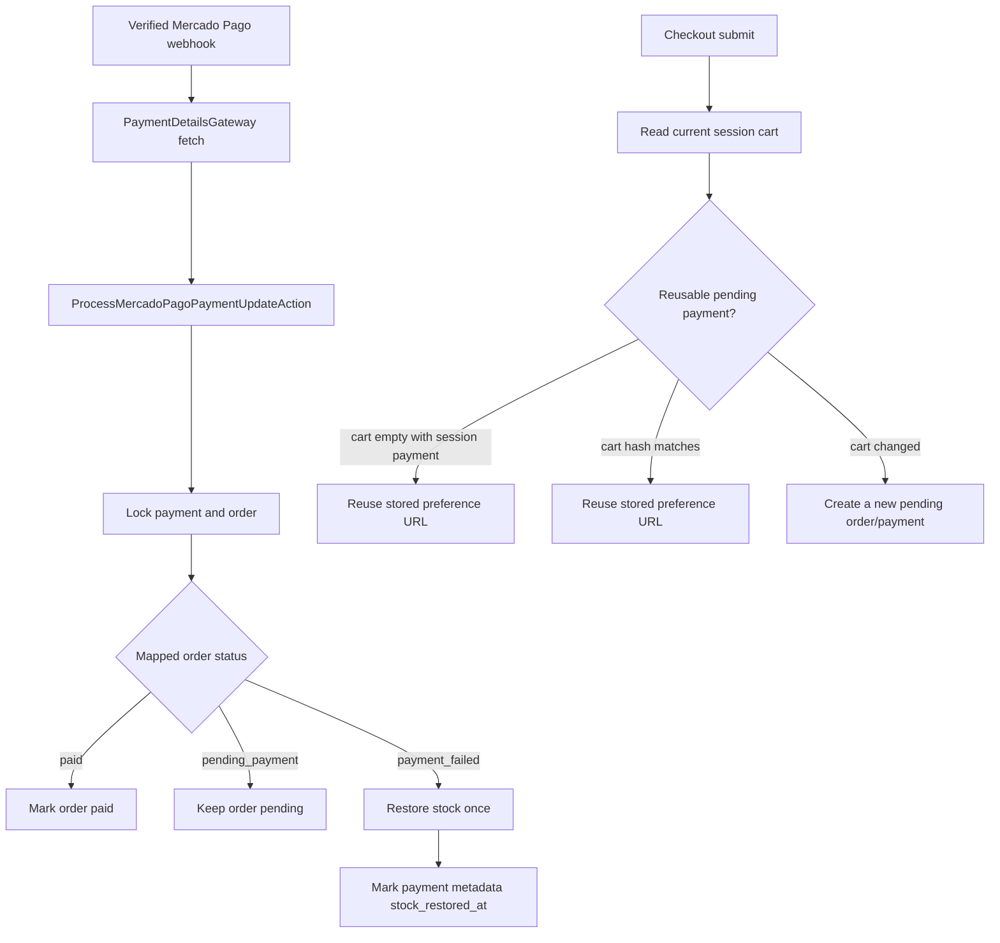

# Wave 05 Summary

## Wave Goal

This wave completes the verified Mercado Pago payment update path and hardens pending Checkout Pro reuse.

It delivers:

- a `PaymentDetailsGateway` contract for fetching full Mercado Pago payment details after a verified webhook
- normalization of provider payment fields before local state changes
- idempotent payment/order updates driven by fetched provider data, not browser return query params
- amount and currency guardrails before an approved payment can mark the order paid
- idempotent stock restoration when a payment reaches an error terminal state
- protection against reusing a stale pending Mercado Pago preference when the current cart changed
- safe reuse of the session pending preference when the cart is empty after checkout start
- regression coverage for payment update idempotency, webhook processing, and checkout preference reuse

## Short Flow

## Main Call Direction Between Modules

### Payments

- `HandleMercadoPagoWebhookAction` calls the payment processor only after signature validation and only for the `payment` event.
- `PaymentDetailsGateway` isolates the Mercado Pago `GET /v1/payments/{id}` call behind a contract.
- `ProcessMercadoPagoPaymentUpdateAction` keeps status processing transaction-bound, matches the local payment by `external_reference`, and restores stock when Mercado Pago maps to `OrderStatus::PaymentFailed`.
- Approved payments only mark orders as `paid` when provider amount/currency match the local payment.
- `CreateCheckoutPreferenceAction` records the pending local payment in the session so an empty-cart retry can safely reuse the same Checkout Pro URL.

### Cart

- The cart remains the source of truth for the buyer's current checkout intent.
- If a non-empty cart matches the existing pending checkout hash, the pending preference is reused.
- If the cart changed, checkout creates a fresh pending order/payment instead of redirecting the buyer to an old preference.

### Catalog And Orders

- Product stock is still decremented when the pending order is created.
- Stock is restored only once when the associated payment reaches an error terminal state.
- The marker for stock restoration lives on payment metadata so repeated webhook deliveries do not restock repeatedly.

## Central Idea Of Each Module

### Payments

Central idea:
own checkout and webhook-driven payment state transitions while keeping Mercado Pago details behind Actions and gateways.

What it does now:

- fetches full Mercado Pago payment details server-side after a verified webhook
- starts Checkout Pro from a local pending order/payment
- reuses an existing preference only when it still represents the current cart state
- maps approved, pending, and failed Mercado Pago statuses into local payment/order states
- keeps the order pending if an approved provider response does not match the local amount/currency
- restores stock once for failed/cancelled/refunded/charged-back payment outcomes

### Cart

Central idea:
represent the buyer's current intended purchase until checkout has a durable local payment/order reference.

What it does now:

- prevents stale session payment references from bypassing changed cart contents
- can be empty after checkout redirect while the session still points to the reusable pending payment

### Orders And Catalog

Central idea:
keep stock movement explicit around order/payment state changes.

What they do now:

- orders keep the local payment/fulfillment status
- order items provide the stock restoration quantities
- catalog products receive stock back exactly once when a payment terminally fails

## What This Wave Does Not Cover Yet

This wave still does not include:

- automatic fulfillment after payment completion
- admin payment visibility improvements beyond the local state now being updated
- refund orchestration beyond mapping refunded/charged-back statuses to a failed payment state
- expiration or cleanup of abandoned pending payments
- a broader inventory reservation ledger
- customer account history or multi-session cart reconciliation

## Practical Reading Of The Design

If you want the shortest interpretation:

1. a verified webhook now fetches the full payment from Mercado Pago before updating the local payment/order
2. an approved/accredited Mercado Pago payment marks the local order as `paid`
3. an approved Mercado Pago payment with mismatched amount/currency is preserved for review instead of marking the order paid
4. a failed Mercado Pago payment no longer leaves inventory reserved permanently
5. a stale session payment id no longer redirects a buyer to a checkout for old cart contents
6. repeated webhooks and duplicate checkout submits remain covered by focused payment tests
