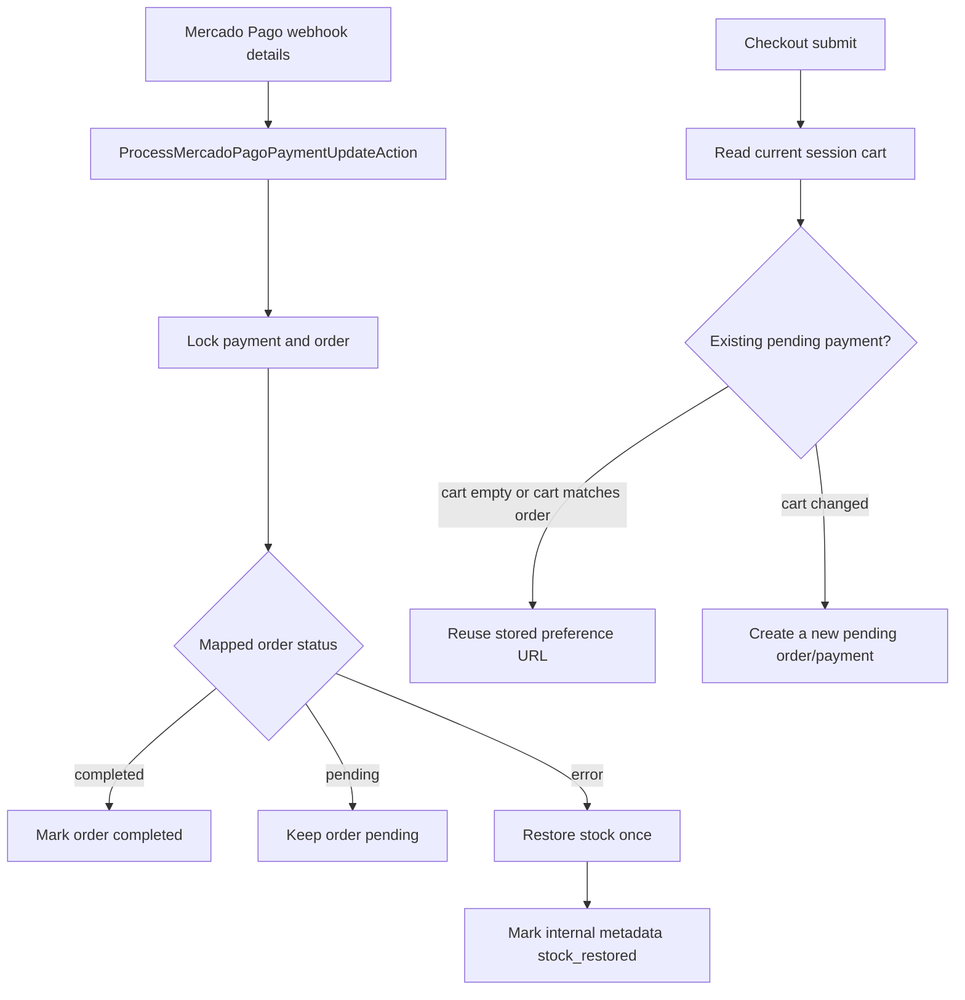

# Wave 05 Summary

## Wave Goal

This wave hardens the Mercado Pago checkout flow after PR review feedback.

It delivers:

- idempotent stock restoration when a payment reaches an error terminal state
- protection against reusing a stale pending Mercado Pago preference when the current cart changed
- regression coverage for both payment update idempotency and checkout preference reuse

## Short Flow

## Main Call Direction Between Modules

### Payments

- `StartPaymentCheckoutAction` now reads the current cart before deciding whether a session pending payment can be reused.
- A pending payment can be reused only when the cart is empty or when the cart item fingerprint matches the existing order items.
- `ProcessMercadoPagoPaymentUpdateAction` keeps status processing transaction-bound and restores stock when Mercado Pago maps to `OrderStatus::Error`.

### Cart

- The cart remains the source of truth for the buyer's current checkout intent.
- If a non-empty cart matches the existing pending order, the cart is cleared when the pending preference is reused.
- If the cart changed, checkout creates a fresh pending order/payment instead of redirecting the buyer to an old preference.

### Catalog And Orders

- Product stock is still decremented when the pending order is created.
- Stock is restored only once when the associated payment reaches an error terminal state.
- The marker for stock restoration lives on payment metadata so repeated webhook deliveries do not restock repeatedly.

## Central Idea Of Each Module

### Payments

Central idea:
own checkout and webhook-driven payment state transitions while keeping Mercado Pago details behind Actions and gateways.

What it does now:

- starts Checkout Pro from a local pending order/payment
- reuses an existing preference only when it still represents the current cart state
- maps approved, pending, and failed Mercado Pago statuses into local order states
- restores stock once for failed/cancelled/refunded/charged-back payment outcomes

### Cart

Central idea:
represent the buyer's current intended purchase until checkout has a durable local payment/order reference.

What it does now:

- prevents stale session payment references from bypassing changed cart contents
- is cleared after a new preference is created or after a matching pending preference is safely reused

### Orders And Catalog

Central idea:
keep stock movement explicit around order/payment state changes.

What they do now:

- orders keep the local fulfillment status
- order items provide the stock restoration quantities
- catalog products receive stock back exactly once when a payment terminally fails

## What This Wave Does Not Cover Yet

This wave still does not include:

- automatic fulfillment after payment completion
- refund orchestration beyond mapping refunded/charged-back statuses to an error state
- expiration or cleanup of abandoned pending payments
- a broader inventory reservation ledger
- customer account history or multi-session cart reconciliation

## Practical Reading Of The Design

If you want the shortest interpretation:

1. a failed Mercado Pago payment no longer leaves inventory permanently reserved
2. a stale session payment id no longer redirects a buyer to a checkout for old cart contents
3. repeated webhooks and duplicate checkout submits remain covered by focused payment tests
