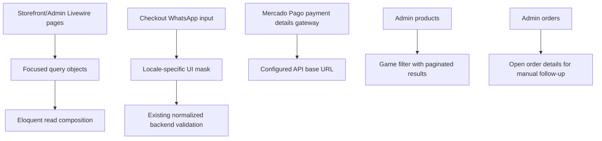

# Wave 08 - Production Readiness Improvements

## Wave Goal

This wave tightens production-facing readiness around query boundaries, external API configuration, admin navigation, storefront checkout input formatting, and remaining placeholder wording.

It keeps the MVP model unchanged:

- checkout still collects only email and WhatsApp
- products are still organized by game and rarity
- payment confirmation and manual fulfillment boundaries stay as implemented in the payment waves

## Short Flow

## Main Call Direction Between Modules

### Catalog And Cart Reads

- Storefront game summaries, featured products, catalog pagination, admin product listings, and cart product image lookup now use focused query objects.
- Simple write Actions still use direct Eloquent where the project decisions allow it.
- Admin product filtering is handled through `ListAdminProductsQuery` and the `/admin/products?game={id}` URL state.

### Payments

- Pending Mercado Pago preference reuse moved into a Payments query object.
- `MercadoPagoPaymentDetailsGateway` reads its API host from `config/apis.php`.
- Mercado Pago credentials and behavior flags remain in `config/services.php`.

### Storefront Checkout

- The WhatsApp input shows a Brazilian mask for `pt_BR` and a United States mask for `en`.
- The submitted field remains `whatsapp`; backend validation still strips non-digits and enforces the existing accepted length range.

### Admin

- The orders list now exposes an explicit detail action for manual follow-up.
- The products list can be filtered by game without adding a new catalog classification dimension.

## Central Idea Of Each Module

### Catalog

Catalog owns product, game, and rarity reads for storefront and admin screens. Filtering by game remains within the existing MVP catalog model.

### Payments

Payments owns Mercado Pago-specific lookup and reusable checkout preference reads. External URLs are configured instead of embedded in gateway methods.

### Storefront

Storefront stays presentation-focused: it formats checkout input for the selected locale, but does not own checkout business rules.

### Admin

Admin remains operational: products can be narrowed by game, and orders are easier to open for fulfillment review.

## Validation

- `find app config database tests -name '*.php' -print0 | xargs -0 -n1 php -l`
- `git diff --check`
- Project code-review skill pass: no architecture or MVP-scope findings.

Docker validation was blocked because the Docker daemon was unavailable from this session. Host `php artisan` validation was also blocked because the host PHP version is `8.3.6` while Composer requires PHP `>= 8.4.0`.

## What This Wave Does Not Cover Yet

- No new checkout fields.
- No automatic fulfillment.
- No new catalog dimension beyond game and rarity.
- No change to Mercado Pago credential rollout.
- No replacement of simple direct Eloquent writes where they remain clear and local.

## Practical Reading Of The Design

Wave 08 moves repeated or non-trivial reads into explicit query objects, keeps simple Actions simple, removes production-facing placeholder wording, and makes admin/storefront workflows a little more production-ready without expanding the MVP.
