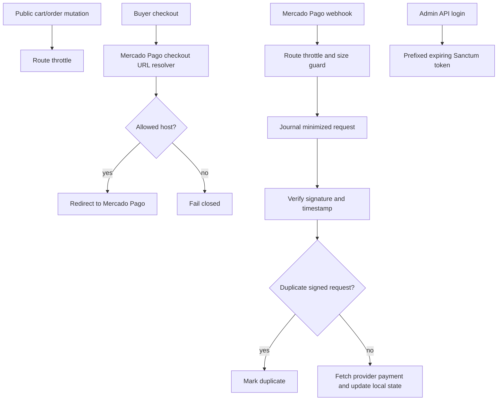

# Wave 09 - Security Hardening

## Wave Goal

This wave hardens public mutation endpoints, Mercado Pago webhook handling, admin API token lifecycle, trusted proxy behavior, and production security defaults.

It keeps the MVP model unchanged:

- checkout still collects only email and WhatsApp
- products are still organized by game and rarity
- stock is still decremented when an order is created
- payment approval still comes from signed server-side webhook processing
- fulfillment remains manual through the admin workflow

## Short Flow

## Main Call Direction Between Modules

### Public API And Rate Limits

- Public cart mutations use the `public-cart-mutations` limiter.
- Public manual order creation uses the `public-order-creation` limiter with IP and session-oriented buckets.
- The old manual order endpoint remains available for the MVP, but now has abuse controls around stock reservation and internal notification noise.

### Payments

- `MercadoPagoCheckoutUrlResolver` allowlists expected Mercado Pago checkout hosts before a buyer can be redirected away.
- `MercadoPagoWebhookController` rejects oversized webhook bodies before journaling.
- `HandleMercadoPagoWebhookAction` journals minimized request data, verifies signatures and timestamp freshness, and stops duplicate verified deliveries before another provider fetch.
- `MercadoPagoPayloadSanitizer` owns the allowlist for stored provider snapshots and webhook payload fields.
- `PruneMercadoPagoWebhookRequestsAction` and `payments:prune-mercado-pago-webhooks` provide an operational cleanup path for old webhook journals.

### Admin API

- Admin API login now issues Sanctum tokens with a finite expiration and a default token prefix.
- Admin order listing now uses pagination so one token cannot retrieve the full order/contact dataset in a single response by default.

### Runtime Configuration

- Trusted proxies are resolved from `TRUSTED_PROXIES`.
- Local and testing environments still allow permissive proxy behavior for ngrok-style webhook development.
- Production session defaults now favor secure cookies and encrypted sessions when explicit env values are not set.
- `.env.production.example` and `security-production.md` document production settings, MFA expectations, webhook retention, and local-only Docker Compose assumptions.

## Central Idea Of Each Module

### Public Entry Points

Central idea:
keep session-backed MVP flows available while adding simple route-level abuse controls.

What they do now:

- limit public cart mutation traffic
- limit public order creation traffic
- keep manual order creation behavior unchanged apart from throttling

### Payments

Central idea:
accept payment state only through a constrained, signed, and minimally retained provider boundary.

What it does now:

- validates webhook signatures with timestamp tolerance enabled by default
- rejects replayed signed webhook deliveries using request id and signature hash
- stores only operational provider fields needed for reconciliation and fulfillment
- rejects unexpected checkout redirect hosts
- offers a retention command for webhook journal cleanup

### Admin

Central idea:
reduce blast radius for privileged API access without changing the admin web workflow.

What it does now:

- issues expiring, prefixed API tokens
- paginates admin order list responses
- still keeps full buyer contact details available where the protected admin flow needs them

### Infrastructure And Configuration

Central idea:
make production security posture explicit while preserving low-friction local development.

What it does now:

- avoids trusting all forwarded headers by default in production
- documents required production session, proxy, token, webhook, and MFA settings
- keeps the existing Docker Compose stack documented as local development only

## Validation

- `docker exec ecommerce-app-1 php artisan test` - 165 passed, 896 assertions.
- `git diff --check`
- Project code-review skill pass: no blocking architecture, security, or MVP-scope findings remained.

`docker exec ecommerce-app-1 vendor/bin/pint --test` was also run. It still reports three pre-existing style issues outside this wave:

- `app/Livewire/Storefront/Cart.php`
- `app/Livewire/Storefront/Home.php`
- `tests/Feature/Payments/MercadoPagoCheckoutEnvironmentTest.php`

## What This Wave Does Not Cover Yet

- No full MFA implementation yet; production docs require MFA before real buyer/payment data is processed.
- No automatic item delivery or fulfillment automation.
- No removal of the manual `POST /api/orders` flow.
- No admin UI for token inventory, token revocation, or webhook journal browsing.
- No database migration for unique webhook replay keys; duplicate detection is implemented at the application layer.
- No live infrastructure verification for TLS, CDN, WAF, backups, DNS, or Mercado Pago dashboard settings.

## Practical Reading Of The Design

Wave 09 adds lightweight security controls around the riskiest public and privileged boundaries without changing the MVP product model. Public mutation paths are throttled, provider data retention is minimized, webhooks are fresher and harder to replay, admin API tokens have a lifecycle, and production deployment expectations are documented clearly.
