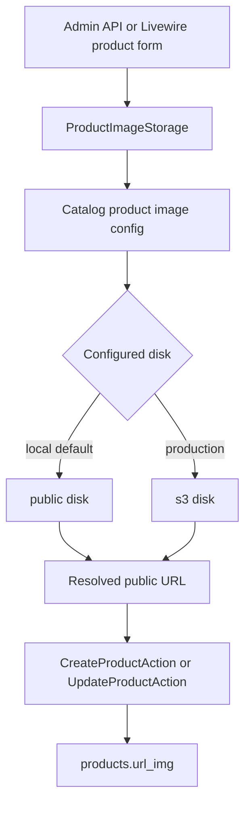

# Wave 10 - Product Image Storage Migration To S3

## Wave Goal

This wave prepares product image uploads to move from the local public disk to AWS S3 through Laravel filesystem configuration.

It keeps the MVP model unchanged:

- products are still organized by game and rarity
- `products.url_img` still stores the renderable image URL consumed by API resources, Livewire, and storefront views
- admin product create still requires one image
- admin product edit can still replace the image optionally
- checkout, payment, order, stock, and fulfillment behavior do not change

## Short Flow

## Main Call Direction Between Modules

### Catalog Product Images

- `ProductImageStorage` remains the only product-image storage boundary.
- It reads `catalog.product_images.disk` and `catalog.product_images.directory`.
- It stores uploads through `Storage::disk($disk)` and returns the URL resolved by that disk.
- It deletes replaced or failed uploads only when the URL can be mapped back to the configured product image directory.

### Admin Entry Points

- Admin API and Livewire product flows still call `ProductImageStorage`.
- Controllers and Livewire components do not know whether the backing disk is local or S3.
- Existing create/update cleanup behavior is preserved: new uploads are removed if persistence fails, and replaced owned images are removed after a successful update.

### Runtime Configuration

- Local default remains `PRODUCT_IMAGE_DISK=public`.
- Production can set `PRODUCT_IMAGE_DISK=s3`.
- `PRODUCT_IMAGE_DIRECTORY=products` keeps the current path shape by default.
- Laravel's existing S3 disk continues to use `AWS_ACCESS_KEY_ID`, `AWS_SECRET_ACCESS_KEY`, `AWS_DEFAULT_REGION`, `AWS_BUCKET`, `AWS_URL`, `AWS_ENDPOINT`, and `AWS_USE_PATH_STYLE_ENDPOINT`.

## Central Idea Of Each Module

### Catalog

Central idea:
keep image storage as a small Catalog-owned infrastructure boundary instead of spreading S3 details through product entry points.

What it does now:

- stores product images on the configured disk and directory
- returns stable browser-renderable image URLs
- conservatively maps owned URLs back to storage paths for cleanup
- ignores unknown or out-of-directory URLs

### Admin

Central idea:
preserve the current product management workflow while letting deployment choose where product images live.

What it does now:

- creates products with an uploaded image
- optionally replaces images during edit
- cleans up the new image when create/update persistence fails
- deletes the previous owned image after a successful replacement

### Configuration

Central idea:
make the S3 switch a deployment setting, not a code branch.

What it does now:

- adds `config/catalog.php` for product-image storage settings
- adds product-image env defaults to `.env.example`
- adds the Laravel S3 Flysystem adapter dependency

## Validation

- `docker exec ecommerce-app-1 composer validate` - passed.
- `docker exec ecommerce-app-1 php artisan config:clear` - passed.
- `docker exec ecommerce-app-1 php artisan test --filter=ProductImageStorage` - 4 passed, 8 assertions.
- `docker exec ecommerce-app-1 php artisan test --filter=ProductsCrudTest` - 8 passed, 49 assertions.
- `docker exec ecommerce-app-1 php artisan test --filter=ProductsApiTest` - 11 passed, 98 assertions.
- `docker exec ecommerce-app-1 php artisan test --filter=Catalog` - 16 passed, 46 assertions.
- `docker exec ecommerce-app-1 vendor/bin/pint --test app/Modules/Catalog/ProductImages/ProductImageStorage.php tests/Feature/Admin/ProductsCrudTest.php tests/Feature/Catalog/ProductImageStorageTest.php config/catalog.php` - passed.
- Project code-review skill pass: no blocking architecture, storage-boundary, AWS credential, or MVP-scope findings remained.

`docker exec ecommerce-app-1 php artisan test --filter=AdminProducts` was also run, but the current test suite has no matching test names for that documented filter.

`docker exec ecommerce-app-1 vendor/bin/pint --test` was also run. It still reports three pre-existing style issues outside this wave:

- `app/Livewire/Storefront/Cart.php`
- `app/Livewire/Storefront/Home.php`
- `tests/Feature/Payments/MercadoPagoCheckoutEnvironmentTest.php`

## What This Wave Does Not Cover Yet

- No migration of old local image objects to S3.
- No product gallery, thumbnails, optimization, or background processing.
- No direct browser-to-S3 upload flow.
- No private S3 objects or signed image URLs.
- No CDN, bucket, CORS, IAM, or infrastructure provisioning.
- No committed AWS secrets.
- No live manual validation against a non-production S3 bucket in this workspace.

## Practical Reading Of The Design

Wave 10 keeps product image storage boring on purpose. The admin flows still ask one Catalog boundary to store and clean up product images, while the deployment decides whether that boundary points at `public` or `s3`. The database keeps storing a renderable URL, so API resources, Livewire components, cart views, and storefront views continue reading `image_url` the same way.
