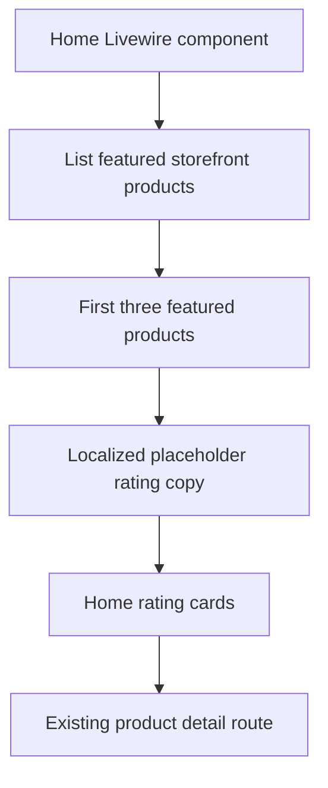

# Wave 11 - Home Rating Trust Section

## Wave Goal

This wave adds a storefront-only rating/testimonial section to the home page.

It keeps the MVP model unchanged:

- ratings are temporary placeholder content
- no customer rating submission exists
- no review table, API, route, migration, or backend rating system was added
- product links use existing storefront product detail routes
- checkout, payment, order, stock, and fulfillment behavior do not change

## Short Flow

## Main Call Direction Between Modules

### Storefront Home

- `Home` still reads games and featured products through existing Catalog queries.
- It now derives up to three front-only testimonial card records from the first three featured products.
- Each card keeps a fixed five-star rating, localized fake comment copy, reviewer metadata, product image, product name, and product detail link.

### Localization

- Placeholder testimonial copy lives in `lang/en/storefront.php` and `lang/pt_BR/storefront.php`.
- The copy is intentionally restrained and editable.
- The wording avoids claiming automated fulfillment, instant delivery, or real customer-submitted reviews.

### Tests

- The frontend foundation test now verifies that the home page renders three front-only rating cards.
- It also verifies that each mini product link points to the first three products selected by the existing featured-product query.

## Central Idea Of Each Module

### Catalog

Central idea:
continue owning product availability and featured product ordering.

What it does now:

- returns available featured products
- keeps product detail routes backed by real product records
- remains the source for product name and image data shown inside rating cards

### Storefront

Central idea:
add trust-building presentation without creating a rating domain.

What it does now:

- renders a dark responsive rating section on the home page
- shows exactly three cards when at least three featured products exist
- renders fewer cards if fewer featured products exist
- links each fake comment to an existing purchasable product page

## Validation

- `docker exec ecommerce-app-1 vendor/bin/pint tests/Feature/Frontend/FrontendFoundationTest.php app/Livewire/Storefront/Home.php` - passed.
- `docker exec ecommerce-app-1 vendor/bin/pint --test app/Livewire/Storefront/Home.php` - passed.
- `docker exec ecommerce-app-1 php artisan test tests/Feature/Frontend/FrontendFoundationTest.php` - 12 passed, 64 assertions.
- `docker exec ecommerce-app-1 php artisan test tests/Feature/Frontend` - 24 passed, 122 assertions.
- `docker exec ecommerce-frontend-1 npm run build` - passed.
- `git diff --check` - passed.
- Project code-review skill pass: no blocking frontend architecture, localization, MVP-scope, or rating-domain findings remained.

`npm run build` was also attempted on the host, but this shell does not have `npm` installed. The same build passed inside the running frontend container.

`docker exec ecommerce-app-1 php artisan test` was also run. It still reports one pre-existing payment URL scheme failure outside this wave:

- `tests/Feature/Payments/CheckoutPreferenceActionTest.php`

`docker exec ecommerce-app-1 vendor/bin/pint --test` was also run. It still reports two pre-existing style issues outside this wave:

- `app/Livewire/Storefront/Cart.php`
- `tests/Feature/Payments/MercadoPagoCheckoutEnvironmentTest.php`

## What This Wave Does Not Cover Yet

- No real testimonial sourcing.
- No public rating submission.
- No review moderation.
- No review persistence.
- No product-level rating aggregate.
- No admin rating management.

## Practical Reading Of The Design

Wave 11 adds the visual trust section the storefront needs without pretending a review product exists. The home page can now show three polished verified-purchase cards tied to real featured products, while the copy remains localized, temporary, and easy to replace when real customer review collection becomes part of the product.
