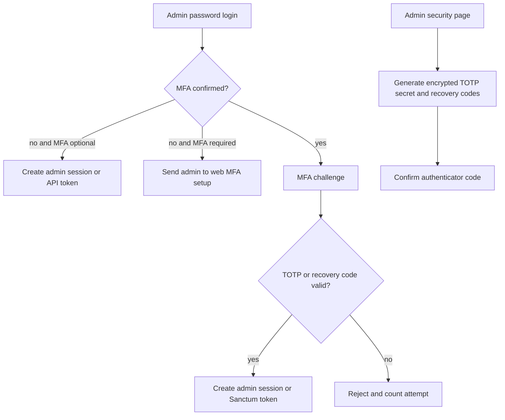

# Wave 12 - Admin MFA With TOTP

## Wave Goal

This wave adds multi-factor authentication to the privileged admin boundary using TOTP authenticator apps and single-use recovery codes.

It keeps the MVP model unchanged:

- customer storefront authentication is not introduced
- checkout still collects only email and WhatsApp
- catalog, cart, order, payment, stock, and fulfillment behavior do not change
- admin API tokens are still Sanctum tokens, but token issuance can now require MFA first

## Short Flow

## Main Call Direction Between Modules

### Admin Web

- Admin login still starts with username/email and password through `AuthenticateAdminAction`.
- Confirmed-MFA admins do not receive a web session until the second factor succeeds.
- When `ADMIN_MFA_REQUIRED=true`, admins without confirmed MFA can only reach the security setup page and logout until setup is confirmed.
- `/admin/security` owns enrollment, confirmation, recovery-code regeneration, and disabling MFA when the environment allows it.

### Admin API

- `POST /api/admin/auth/login` still issues a Sanctum token for admins without MFA when MFA is not required.
- Confirmed-MFA admins receive `mfa_required`, a `challenge_id`, and `expires_at`; no token is created yet.
- `POST /api/admin/auth/mfa-challenge` verifies a TOTP or recovery code before issuing the Sanctum token.
- Required but unconfirmed MFA returns the project problem-details error `mfa_setup_required`.

### MFA Storage And Runtime Config

- User records now store an encrypted TOTP secret, encrypted recovery codes, and `two_factor_confirmed_at`.
- Fortify is installed only for TOTP primitives and route ownership is disabled.
- `ADMIN_MFA_REQUIRED`, `ADMIN_MFA_CHALLENGE_TTL_SECONDS`, and `ADMIN_MFA_MAX_ATTEMPTS` control rollout and challenge behavior.

## Central Idea Of Each Module

### Admin

Central idea:
protect privileged operations without replacing the existing admin auth boundary.

What it does now:

- keeps credential validation in the existing Admin Action
- adds MFA setup and challenge Actions around that boundary
- blocks token/session creation until confirmed MFA succeeds when the admin has MFA enabled
- supports recovery codes as one-time fallback credentials

### Users

Central idea:
store only the MFA material needed for admin authentication.

What it does now:

- hides MFA fields from serialization
- treats MFA as confirmed only when both the secret and confirmation timestamp exist
- keeps customer records unaffected unless they later become admins

## Validation

- `docker exec ecommerce-app-1 php artisan migrate --pretend` - passed.
- `docker exec ecommerce-app-1 php artisan route:list` - passed, Fortify auth routes are not registered.
- `docker exec ecommerce-app-1 php artisan config:clear` - passed.
- `docker exec ecommerce-app-1 php artisan test --filter=AdminMfaTest` - 7 passed, 41 assertions.
- `docker exec ecommerce-app-1 php artisan test --filter=AuthApiTest` - 16 passed, 118 assertions.
- `docker exec ecommerce-app-1 php artisan test --filter=Admin` - 78 passed, 541 assertions.
- Project code-review skill pass: one confirmed-MFA detection issue was found and fixed; no blocking MFA architecture, security, or MVP-scope findings remained.

`docker exec ecommerce-app-1 php artisan test` was also run. It still reports one pre-existing payment URL scheme failure outside this wave:

- `tests/Feature/Payments/CheckoutPreferenceActionTest.php`

`docker exec ecommerce-app-1 vendor/bin/pint --test` was also run. It still reports two pre-existing style issues outside this wave:

- `app/Livewire/Storefront/Cart.php`
- `tests/Feature/Payments/MercadoPagoCheckoutEnvironmentTest.php`

## What This Wave Does Not Cover Yet

- No customer MFA.
- No SMS, email OTP, passkeys, trusted devices, or risk scoring.
- No API-based MFA enrollment flow.
- No admin token inventory or token revocation UI.
- No change to checkout, payment approval, stock, or manual fulfillment rules.

## Practical Reading Of The Design

Wave 12 closes the admin single-factor security gap without pulling in Jetstream or replacing the app's custom admin surface. Fortify supplies the proven TOTP pieces, while the project keeps ownership of routes, Actions, Livewire screens, API responses, and rollout policy.
