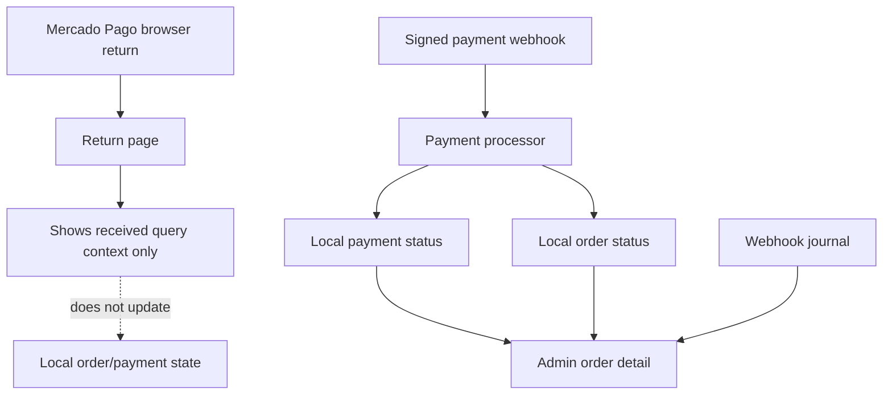

# Wave Payment 06 - Return Pages And Admin Visibility

## Wave Goal

Make the payment experience honest for buyers and operational for admins.

Browser return pages still show Mercado Pago context, but they do not mark an order as paid. The admin order detail now shows the local payment verification state that staff should use before manual fulfillment.

## Short Flow

## Main Call Direction Between Modules

### Storefront

- Return pages use localized copy for success, failure, and pending routes.
- They display received Mercado Pago query values as context only.
- They explicitly keep server-side payment verification as the source of truth.

### Payments

- `Payment` exposes its related Mercado Pago webhook request rows.
- Admin-facing reads use sanitized payment fields only: local status, provider payment id, provider status/detail, last local provider update, and journal reference.
- Raw provider snapshots, headers, signatures, secrets, and card data are not shown.

### Orders And Admin

- `GetAdminOrderQuery` loads order items, payments, and payment webhook journal rows for the order detail.
- `AdminOrderResource` includes a sanitized `latest_payment` block when the relation is loaded.
- `Livewire\Admin\Orders\Show` decides whether manual fulfillment is allowed from local state: order `paid` plus local payment `approved`.

## Central Idea Of Each Module

### Orders

Orders remain the admin operational record. The order status tells staff whether fulfillment is allowed, but it is only trusted after the payment processor updated local state.

### Payments

Payments own provider status and webhook diagnostics. The admin sees enough to investigate the payment without exposing sensitive gateway payloads.

### Admin

Admin stays a simple operational surface. It does not process payment logic; it only presents the local payment state that already exists.

## What This Wave Does Not Cover Yet

- No automatic fulfillment.
- No refund or dispute admin workflow.
- No full webhook journal browsing screen.
- No secrets, signatures, raw provider payloads, or card data in admin views.

## Practical Reading Of The Design

The buyer return page is informational. The admin fulfillment decision comes from local payment/order state that was updated by signed webhook processing and provider fetches.
