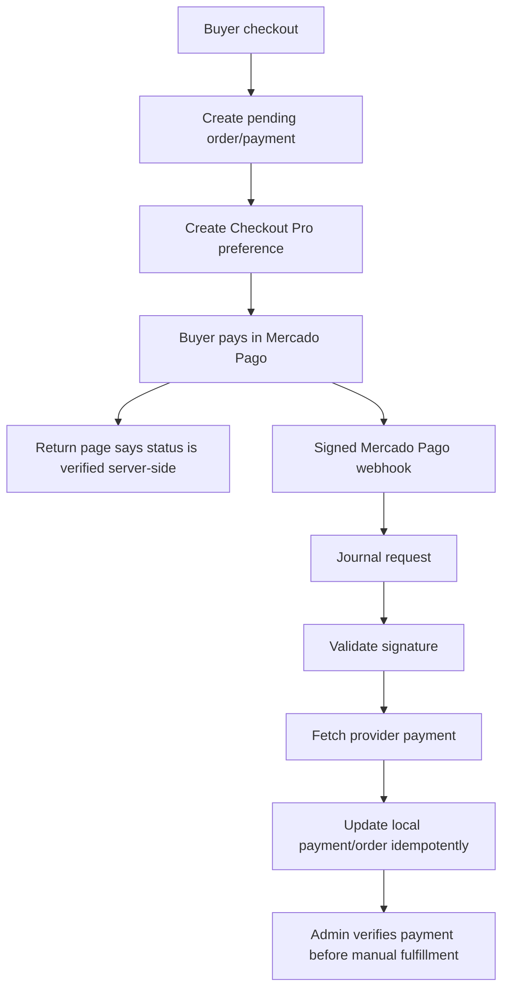

# Wave Payment 07 - Final Validation And Operational Docs

## Wave Goal

Close the Mercado Pago Checkout Pro integration for the current MVP with validation, documentation, and a project-aware code review.

The payment module now covers durable checkout start, server-side webhook verification, idempotent local state updates, buyer return copy, and admin visibility for manual fulfillment.

## Short Flow

## Main Call Direction Between Modules

### Storefront Checkout

- `Livewire\Storefront\Checkout` collects only email and WhatsApp.
- `CreateCheckoutPreferenceAction` creates or reuses a pending local checkout state.
- Return pages never approve payments from browser query parameters.

### Payments

- Payment persistence stores the local external reference, provider ids, local status, provider status/detail, and sanitized metadata.
- Mercado Pago webhook handling journals every received request before processing.
- Signature validation happens before provider fetches or local state updates.
- `ProcessMercadoPagoPaymentUpdateAction` maps provider payment details into local payment/order status and restores stock once for failed terminal states.

### Orders

- Orders own buyer contact, item snapshots, stock decrement at order creation, and manual fulfillment status.
- Admin reads the order with payment context, but payment processing remains in the Payments module.

### Admin

- Admin order detail shows payment verification data needed for manual fulfillment.
- Fulfillment is allowed only when local order/payment state says the payment was verified.

## Validation

- `docker exec ecommerce-app-1 php artisan test tests/Feature/Admin/AdminPartThreeTest.php tests/Feature/Api/Admin/OrdersApiTest.php tests/Feature/Frontend/MercadoPagoCheckoutTest.php tests/Feature/Payments/MercadoPagoWebhookTest.php tests/Feature/Payments/ProcessMercadoPagoPaymentUpdateActionTest.php`
- `docker exec ecommerce-app-1 php artisan test tests/Feature/Orders tests/Feature/Payments tests/Feature/Frontend/MercadoPagoCheckoutTest.php tests/Feature/Api/Admin/OrdersApiTest.php tests/Feature/Admin/AdminPartThreeTest.php`
- `docker exec ecommerce-app-1 vendor/bin/pint --test`
- Project code-review skill pass: no critical payment security or correctness findings remained.

## What This Wave Does Not Cover Yet

- No automatic item delivery after payment.
- No production credential rollout or live production payment certification.
- No admin action for refunds, chargebacks, or disputes.
- No automatic cleanup of abandoned pending payments.
- No dedicated webhook journal admin screen.

## Practical Reading Of The Design

The integration is complete for the MVP payment boundary: checkout creates durable local records, Mercado Pago confirms payment through signed server-side webhooks, and admins get a clear local signal before manual fulfillment.
